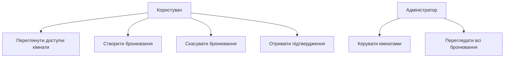

# pz-UML

Побудова повердінкових UML-діаграм для проєктування інформаційних систем

## Предметна область

Інформаційна система: **система бронювання переговорної кімнати**.

Система дозволяє користувачу переглядати доступні кімнати, створювати бронювання, отримувати підтвердження, а адміністратору — керувати кімнатами та бронюваннями.

---

## Use Case Diagram

