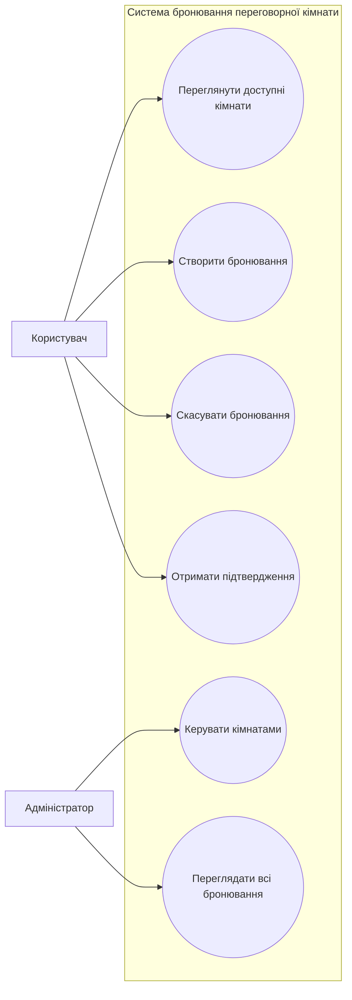

# UML Project

## Посилання на діаграми

- [Use Case Diagram](#use-case-diagram)
- [Sequence Diagram](#sequence-diagram)
- [Activity Diagram](#activity-diagram)

## Use Case Diagram

```mermaid
flowchart LR

    User[Користувач]
    Admin[Адміністратор]

    subgraph System["Система бронювання переговорної кімнати"]
        UC1((Переглянути доступні кімнати))
        UC2((Створити бронювання))
        UC3((Скасувати бронювання))
        UC4((Отримати підтвердження))
        UC5((Керувати кімнатами))
        UC6((Переглядати всі бронювання))
    end

    User --> UC1
    User --> UC2
    User --> UC3
    User --> UC4

    Admin --> UC5
    Admin --> UC6
```
