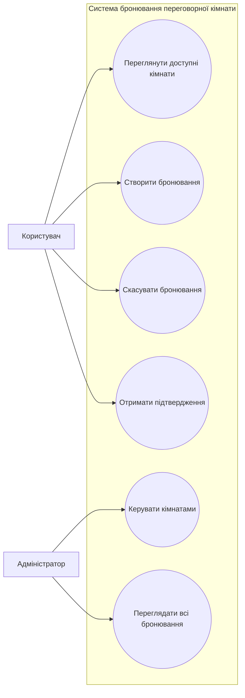
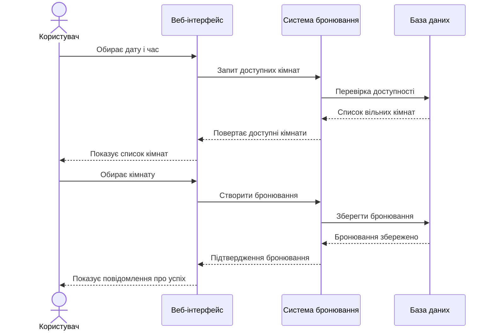
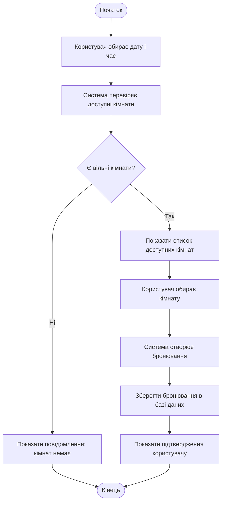

# UML Project

## Посилання на діаграми

- [Use Case Diagram](#use-case-diagram)
- [Sequence Diagram](#sequence-diagram)
- [Activity Diagram](#activity-diagram)

## Use Case Diagram

Діаграма варіантів використання показує, які дії можуть виконувати основні актори системи.
Користувач може переглядати кімнати, створювати або скасовувати бронювання.
Адміністратор має додаткові можливості: керування кімнатами та перегляд усіх бронювань.

## Sequence Diagram

Діаграма послідовності описує порядок взаємодії між користувачем, інтерфейсом, системою та базою даних під час створення бронювання.

## Activity Diagram

